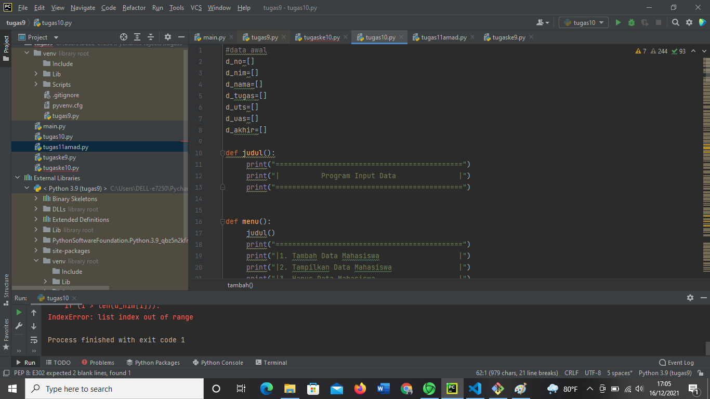
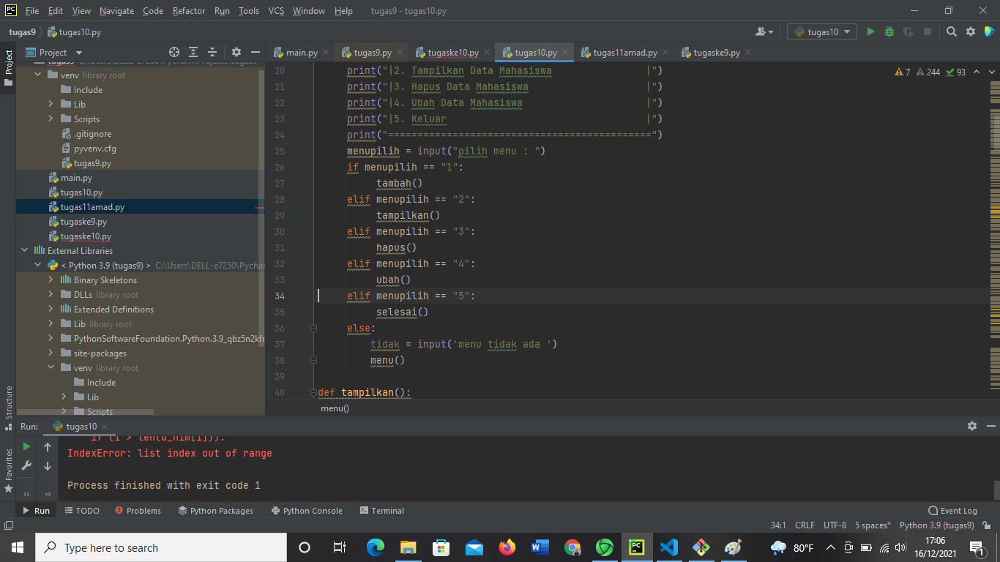
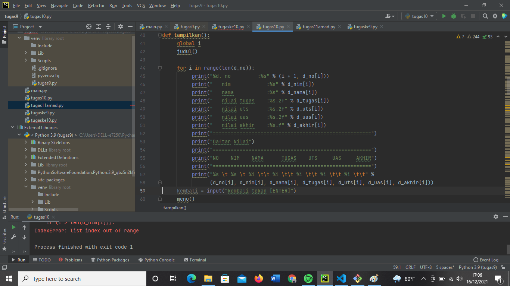
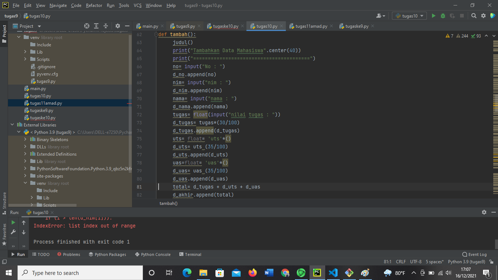
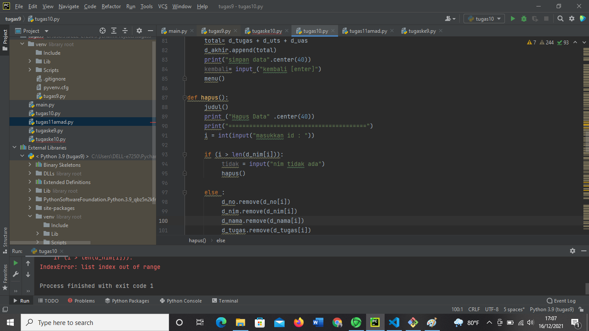
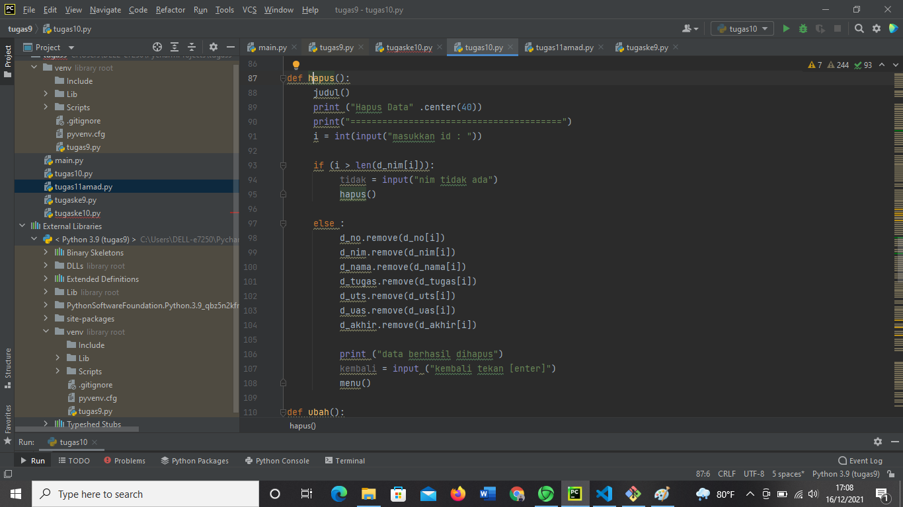
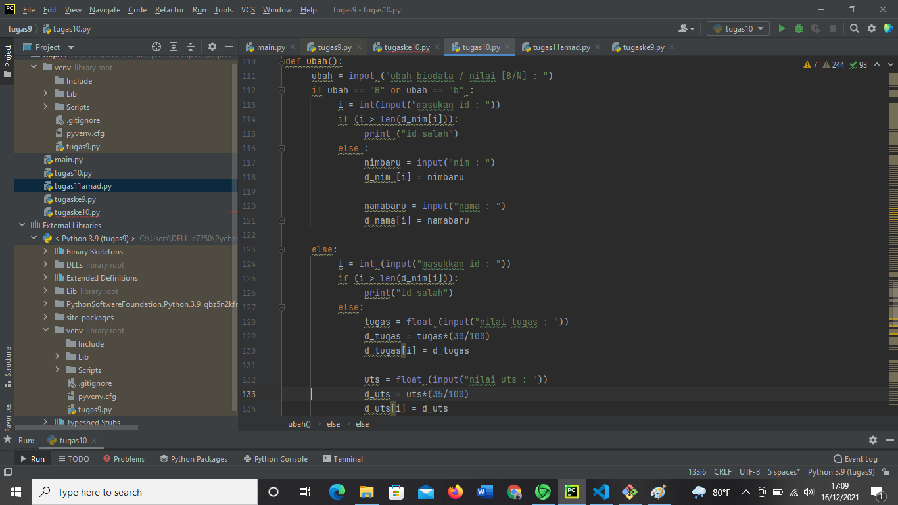
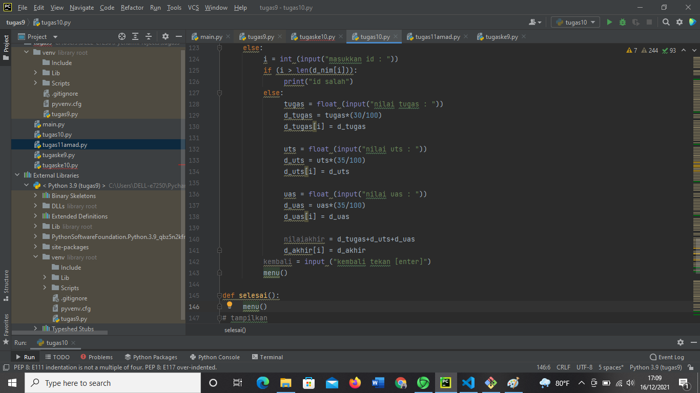
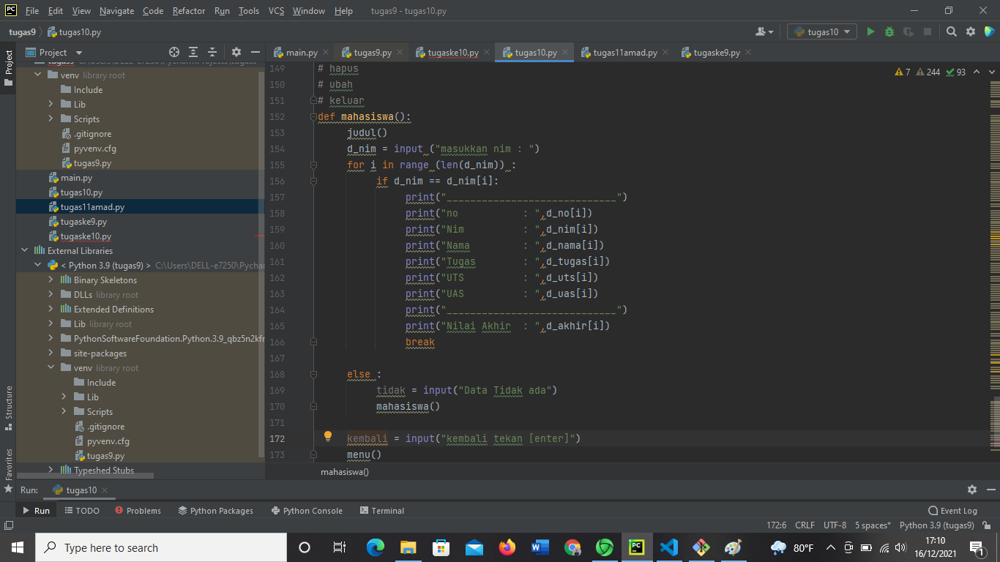
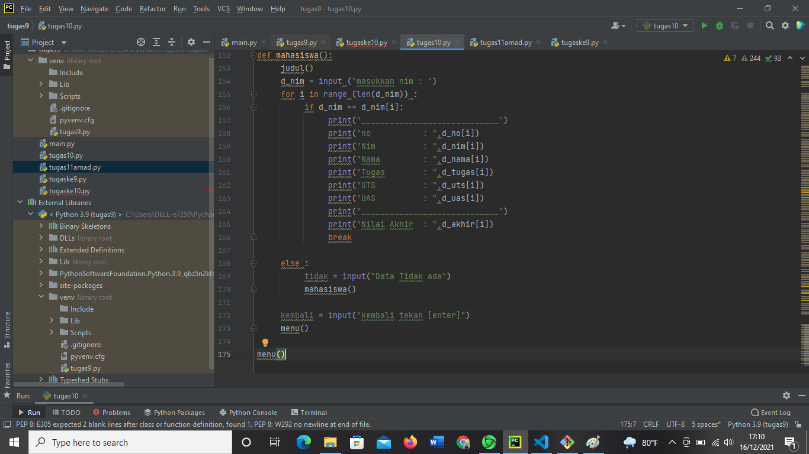

# amadtugas11
## NAMA : AMAD SUMADI
### NIM : 312110525
#### KELAS : TI.21.CA1

##### langkah langkah membuat program dari pengaplikasian fungsi
berikut ini adalah gambar dari langkah langkah tersebut

 